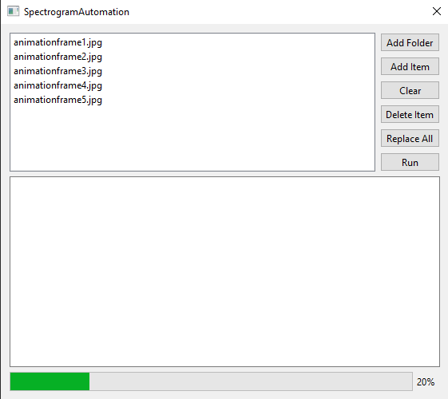

  

## Description
SpecAuto is a program made with Qt to automate the conversion of an image, or sequence of images, to a spectrogram version. It first converts an image to a wav file, and then reproduces the image by running the wav file through a spectrogram tool. It was made to speed up my video editing workflow.

  

## Dependencies and Installation
To use this program, first install SoundExchange (SOX), which can be found [here](https://sourceforge.net/projects/sox/).

To install, navigate to the [releases](https://github.com/4acf/SpecAuto/releases) page and download the latest release (as of now only 64 bit windows is supported). Extract the zip and run the executable file.

All other dependencies needed to build from source are included in the repository, minus Qt itself.

## Notes
Try to use an image with high contrast as it will make the resulting spectrogram more defined.

The program automatically creates a temp folder in order to work. This folder is deleted when the program is closed, but may still exist if the program crashes unexpectedly. Should this ever happen, you will want to clear these folders from your computer's temp directory. Mine for example is located at `AppData/Local/Temp`.

For more info on finding this directory: [QTemporaryDir](https://doc.qt.io/qt-6/qtemporarydir.html)

## Known Issues:
-Filenames with spaces are not parsed properly and cannot be converted. For the time being, please edit your filenames to not include spaces.

-Successive runs will duplicate the messages printed to the progress console.

-Aspect ratio of spectrogram is sometimes the same as source image and sometimes not

## Credits
[stb_image](https://github.com/nothings/stb/blob/master/stb_image.h)

[imageSpectrogram.pl](https://github.com/plurSKI/imageSpectrogram/blob/master/imageSpectrogram.pl)

[wav_file.h](https://github.com/Numerix-DSP/wav_file)
