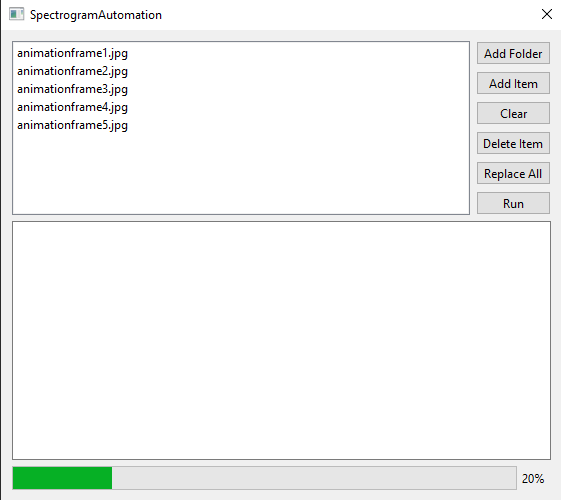

# SpecAuto

## Description
SpecAuto is a program made with Qt to automate the conversion of an image, or sequence of images, to a spectrogram version. It first converts an image to a wav file, and then reproduces the image by running the wav file through a spectrogram tool. It was made to speed up my video editing workflow.

## Releases
There are no current releases as of now. I am working on creating improving this program to produce a prebuilt binary.

## Dependencies
To use this program, first install SoundExchange (SOX), which can be found [here](https://sourceforge.net/projects/sox/).

All other dependencies needed to build from source are included in the repository, minus Qt itself.

## Known Issues:
Program hangs during execution as it doesn't support multithreading currently.

Filenames with spaces are not parsed properly and cannot be converted.

## Credits
[stb_image](https://github.com/nothings/stb/blob/master/stb_image.h)

[imageSpectrogram.pl](https://github.com/plurSKI/imageSpectrogram/blob/master/imageSpectrogram.pl)

[wav_file.h](https://github.com/Numerix-DSP/wav_file)
